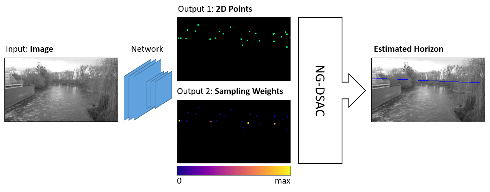
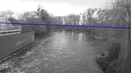
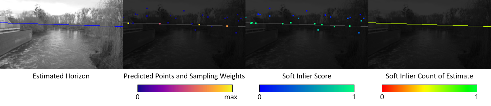

# Neural-Guided, Differentiable RANSAC for Horizon Line Estimation

- [Introduction](#introduction)
- [Quick Start: Demo Script](#quick-start-demo-script)
- [HLW Dataset](#hlw-dataset)
- [Training](#training)
- [Evaluation](#evaluation)
- [Publications](#publications)

## Introduction

NG-DSAC is a general method for fitting parametric models to a set of data points that might contain outliers and noise, i.e. it is a robust estimator. NG-DSAC is a combination of Neural-Guided RANSAC (NG-RANSAC) and Differentiable RANSAC (DSAC). Due to its differentiability, NG-DSAC allows for training a neural network for estimating parametric models. This code provides an implementation of NG-DSAC for estimating the horizon line from a single image. 



A network consumes the input image and predicts two outputs: 1) a set of 2D points that the horizon line is fitted to using NG-DSAC, and 2) for each data point a sampling weight used by NG-DSAC to guide the search for the best model with highest inlier count. The output of the network is the horizon line represented by slope and intercept. The pipeline is trained end-to-end, i.e. the network learn to place the 2D points in a way that the robust model fit leads to a good horizon estimate.

For more details, we kindly refer to the [paper](https://arxiv.org/abs/1905.04132). You find a BibTeX reference of the paper at the end of this readme. 

You find additional material, such as pointers to code for estimation of epipolar geometry and camera re-localization, on the NG-RANSAC [project page](https://hci.iwr.uni-heidelberg.de/vislearn/research/neural-guided-ransac/).

NG-RANSAC is based on PyTorch. It requires the following Python packages, and we tested it with the package version in brackets.
```
pytorch (1.1.0)
opencv (4.1.0)
scikit-image (0.15.0)

```

## Quick Start: Demo Script

The demo script `demo.py` lets you estimate the horizon line for an image or video, using either a pre-trained network or a network you trained yourself.

To run the demo, call:

```bash
python demo.py <input_file>
```
This repository contains an example image `demo.jpg` to serve as `<input_file>`, but you can provide your own images or videos using any format supported by OpenCV. If you pass a video, the demo script will process each frame individually. The demo creates a new folder `out_<input_file>` with output images.



Blue is the estimated horizon line. Note that the demo script only draws an estimate if it has a minimum inlier count. You can change the default threshold using the `-st` option. If you run the demo script with the `-v` flag, it will store an extended visualization:



From left to right: 

* Estimated horizon in blue over the gray scale image
* 2D points and sampling weights predicted by the network, visualized by the OpenCV Plasma color map
* Soft inlier score of each predicted point wrt the estimated horizon, visualized by the OpenCV Winter color map
* Estimated horizon, colored by its inlier count, visualized by the OpenCV HSV color map (only values 0-100 of 255 to get a red-yellow-green gradient)

By default, the demo script uses the network `models/weights_ngdsac_pretrained.net`, but you can provide your own network using the `-m` option. 

Call `demo.py -h` for an overview of all command line arguments.


## HLW Dataset

We trained and evaluated NG-DSAC using the "Horizon Lines in the Wild (HLW)" dataset, **version 1**, by Workman et al. Get the dataset [here](http://www.cs.uky.edu/~jacobs/datasets/hlw/).

Download and unpack the dataset into the root directory of this code. You should end up with a new folder `hlw` with the following contents:

```
./hlw/images/
./hlw/split/
./metadata.csv/

```
The following code will assume the HLW dataset to be present, and access the dataset via the `hlw_dataset.py` class.

## Training

With the HLW dataset in place, you train NG-DSAC using standard settings simply by calling:

```bash
python train.py
```

The script will write a `log_.txt` file with the training progress, namely with the training iteration and training loss per line. The script also regularly stores a snapshot of the network as `weights_.net`.

Call the training script with the `-h` flag to display all available command line options. In particular, you can disable neural guidance and train a DSAC model instead by calling:

```bash
python train.py -sid dsac -u
```
where the `-sid` option just appends a custom name to all output files (to differentiate training runs) and `-u` activates uniform sampling instead of neural guidance sampling. 


## Evaluation

To evaluate a trained network on the HLW test set, call:

```bash
python test.py <network_file>
```
This repository contains a pretrained network for NG-DSAC, `models/weights_dsac_pretrained.net`, which can serve as `<network_file>` The script will write a `test_.txt` file which contains the test image file and the associated test loss in each line. The loss measures the maximum vertical distance between the estimated and ground truth horizon within the image area, normalized by the image height. After processing all test images, the test script displays area under the curve (AUC) up to a maximum loss threshold of 0.25.

Call the test script with the `-h` flag to display all available command line options. Make sure that testing option and options a model was trained with are consistent, e.g. to test our pretrained *DSAC only* network, you would call:


```bash
python test.py models/weights_dsac_pretrained.net -u
```

Note the `-u` flag.

## Publications

Please cite the following paper if you use NG-DSAC or parts of this code in your own work.

```
@inproceedings{brachmann2019ngransac,
  title={{N}eural- {G}uided {RANSAC}: {L}earning Where to Sample Model Hypotheses},
  author={Brachmann, Eric and Rother, Carsten},
  booktitle={ICCV},
  year={2019}
}
```
This code builds on DSAC which was introduced in the following paper:

```
@inproceedings{brachmann2017dsac,
  title={{DSAC} - {D}ifferentiable {RANSAC} for camera localization},
  author={Brachmann, Eric and Krull, Alexander and Nowozin, Sebastian and Shotton, Jamie and Michel, Frank and Gumhold, Stefan and Rother, Carsten},
  booktitle={CVPR},
  year={2017}
}
```
